# Storm Box

### Table of Contents
- [Introduction](#introduction)
- [Storm](#storm)
- [Environment Generation](#environment-generation)
    - [Logic](#logic-1)
    - [Procedural Landscape Materials](#procedural-landscape-materials)
    - [Foliage Generation](#foliage-generation)
- [Spawn Generation](#spawn-generation)
    - [Logic](#logic-2)
    - [Cardboard Box](#cardboard-box)
    - [Platform](#platform)
- [UI](#ui)
- [Key Art & Rendering](#key-art--rendering)
- [Lobby](#lobby)
    - [Greybox](#greybox)
    - [Materials & Assets](#materials--assets)
- [Logo](#logo)
- [Videos](#videos)

## Introduction

> **Figure 1**. Flying around the Storm Box as it moves through procedurally generated terrain.

Storm Box is a gamemode created by ZeroYaHero (me) in Fortnite's User Generated Content (UGC) Ecosystem with Epic Game's Unreal Editor for Fortnite (UEFN) and it's respective (and eventually UE6's) scripting language, Verse. It was developed between late 2023 and early 2024. As of 2025 it no longer recieves updates.

Storm Box can be played following the directions seen here (the project has not been updated recently, so beware of bugs!):
https://www.fortnite.com/@zeroyahero/7521-0495-2926

### Background

After doing a study where I recreated the Epic Game's Storm Shader seen in their Fortnite Battle Royale mode without looking at their methods or files, I wondered how I could use it in a new way. The first thought I had was making the storm a different shape.

In Fortnite, there are two very popular UGC gamemodes, Zone Wars, and Box Fights.
- In Zone Wars, players skip the looting process of a Battle Royale game, and are packed tightly in a smaller zone to duke it out. 
- In Box Fights, players similarly skip the looting process, but are enclosed in a small box with no exits and no natural cover.

Both of the gamemodes are traditionally assumed to take advantage of default Fortnite gameplay mechanics (weapons, building, healing, etc). 

With these two gamemodes being popular, I thought I should make the storm a small box shape. Taking advantage of the strengths of Box Fights & Zone Wars. A comfortable mixture of familiarity and innovation. 

## Storm

Code: [Src/SBI_Objects/SBI_StormBoxStorm](Src/SBI_Objects/SBI_StormBoxStorm)

Storms or Safe Zones in Battle Royales are traditionally circles which randomly select a point within (or outside) the circle with a new smaller radius. With a box shape this is a little less natural, and not to mention the ceilings and floors. Wanting to have verticality, I decided storm phases should move in just one axis at a time (X, Y, Z) with a positive or negative direction. I also decided against having the box shrink. 

The storm phase generation process follows this pattern:
1. The Storm randomly selects an axis to move in. The pool of axises the storm can select from is done by checking the boundaries of the world, and eliminating any axis where the storm cannot move in its defined minimum distance (vertical and horizontal axis has two different minimum and maximum distances due to it being harder to climb than run).
2. Once an axis has been selected, a random value is generated between the minimum and the maximum (where the maximum is clamped to world boundaries) to add to the Storm transform. 
3. Repeat.

> A more primitive version of Storm Box called "Storm Box PvP" released in early 2023 which featured a shrinking box. However, the Fortnite Ecosystem seemed to prefer infinite game loops which allowed join-in-progress (JIP), so shrinking was not included for this release.

> When I was developing, I had not taken any linear algebra course, so there are areas which could be improved in the storm phase location selection.

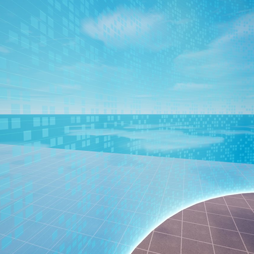

> **Figure 2**. Screenshot showcasing my recreation of Fortnite's Storm Material

At the time of making this game There was no way to write to the minimap material seen on a players heads up display (HUD). To communicate the direction of the Storm Box, I chose to customize my Storm Material to show *green* in the direction the storm was headed, and *red* in the opposite. You can kind of see this in the gif in the [introduction](#introduction).

## Environment Generation

> **Figure 3**. Editted gif showcasing the terrain generation cutscene, and me in debug mode no-clipping through another permutation with debug primitives drawn showcasing bounding box volumes of terrain islands. You may notice the odd layering and shaping of the world in the gif above. That is because I wanted to go for something akin to minecraft or the "Hallelujah Mountains" seen in the Avatar movies. With the limited space above and below given the box shaped storm, traditional landscapes make it harder for players traverse. Too many situations where the storm would be swallowed whole by a mountain. I needed a way for players to be able to go under or over. Considering the desire for infinite gameplay and procedural events, in order for player spawning to be procedural I needed to know where a player *could not* spawn. Generating the terrain myself allows me to control just that.

Code: [Src/SBI_Objects/SBI_EnvironmentGeneration](Src/SBI_Objects/SBI_EnvironmentGeneration)

### Terrain Logic

I did some research on terrain generation within games like Minecraft, and without a noise implementation in the Verse language or its Fortnite and Unreal Engine modules, I wrote one myself. The one referenced in this project is a little outdated, but you can see the updated public source for it in [VerseNoise](https://github.com/ZeroYaHero/VerseNoise).

The environment is constructed by sampling a position and if it is greater than a threshold spawn a terrain prefab.

I researched a few ways to determine if a space was "free" like kd-trees. With limited time and understanding, I chose to just use spatial hashing. 

Every terrain prefab I add, I record it's dimensions. Then, when I spawn that prefab with a randomized scale, I multiply it by those dimensions, and divide it again by the grid size. This way I can calculate how many "grid points" the terrain piece takes up, and I can mark them as "occupied" to prevent spawns from generating there.

Because of the lack of bitwise operators in Verse, three dimensional noise takes too long to execute. I had to make a workaround, so what I did was divide up the world into layers, each with diminishing values in tolerance. The noise permutation is the same for each layer to save on performance, but each layer has a randomized coordinate offset so the layers do not line up perfectly.

### Foliage Logic

The foliage process is rather simple. For each biome and humidity level, I simply add some prefabs for

### Biomes

Biomes are setup by allowing me to configure different humidity and temperature values. Based on the combination of a seperate noise permutation as well as a voroni diagram, I am able to get the biome for each point in the world.

### Procedural Landscape Materials

## Spawn Generation

### Logic

### Cardboard Box
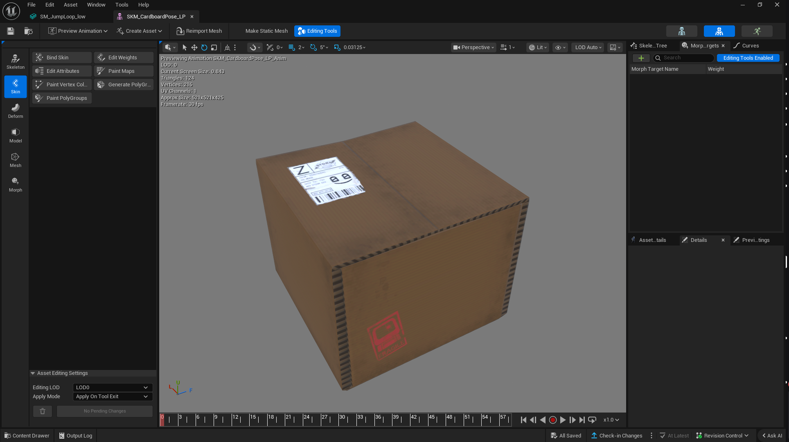
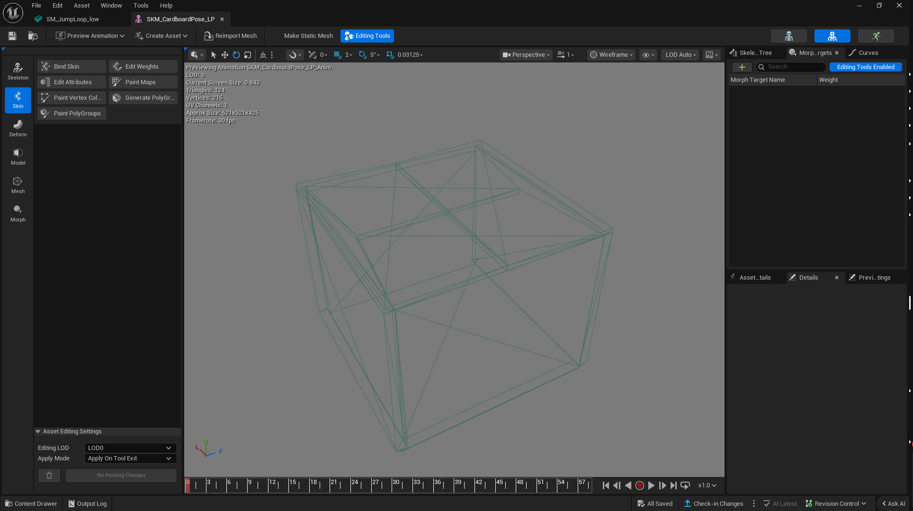

### Platform

## UI

## Key Art & Rendering

### Logo
Initially I wanted to have a physically based 3D rendered logo which contained volumetrics. Additionally, there was a desire for it to be animatable as well. This was my first time using volumetrics and geometry nodes for the lightning. I went through multiple iterations.

#### V1:
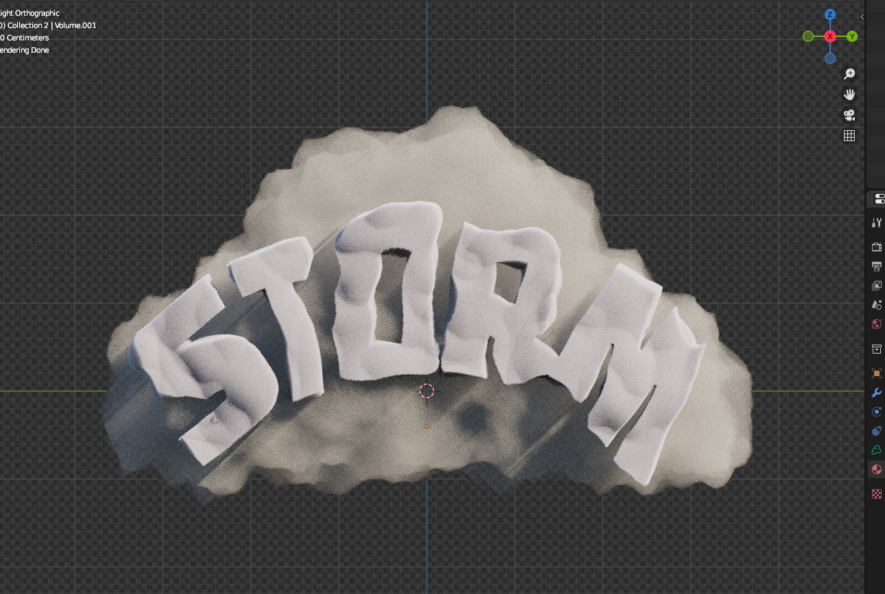
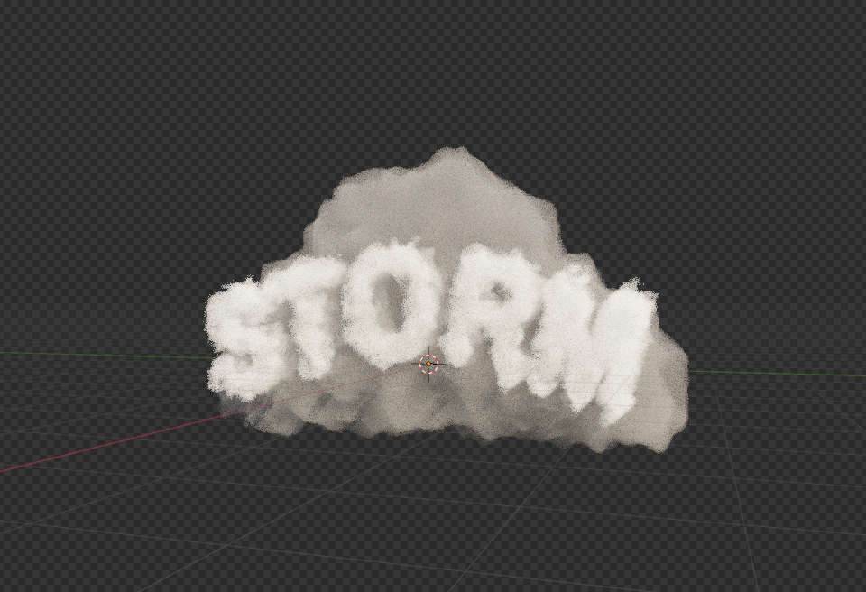
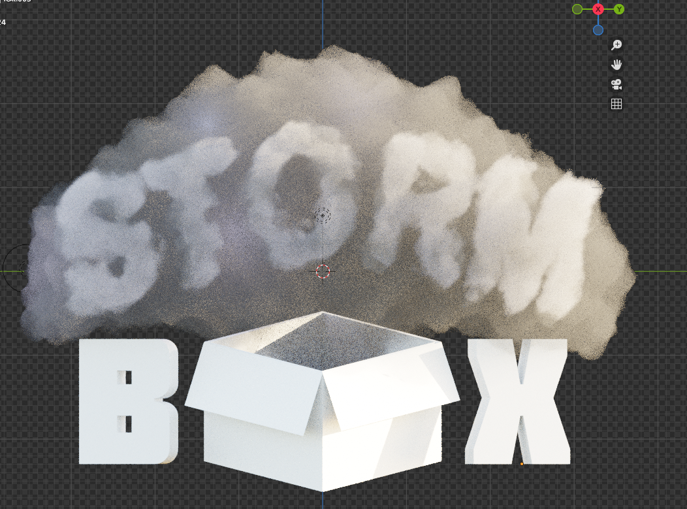

#### V2:
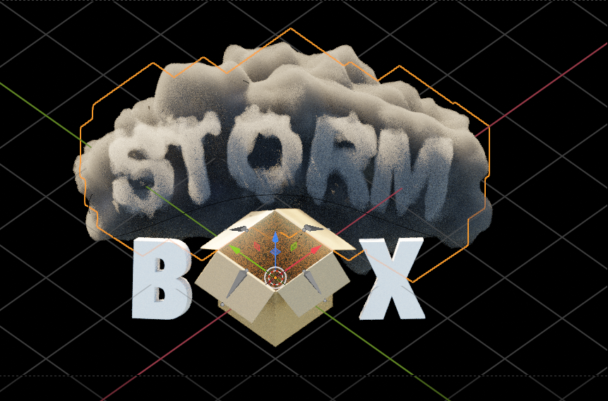

The noise of the viewport actually made the volumetrics look a lot better. When rendered the denoiser made the clouds look more like slime or soap bubbles. I didn't really want to go into photoshop to make it more readable.

Ultimately, I decided to go with a flat logo, as the colors popped more and it is just easier to read ([see logo section](#logo)). I did use and animate the second version for a teaser with my own "sound design," seen in [this Twitter video](https://x.com/ZeroYaHero/status/1695507653219504340?s=20).

### Thumbnail

## Lobby
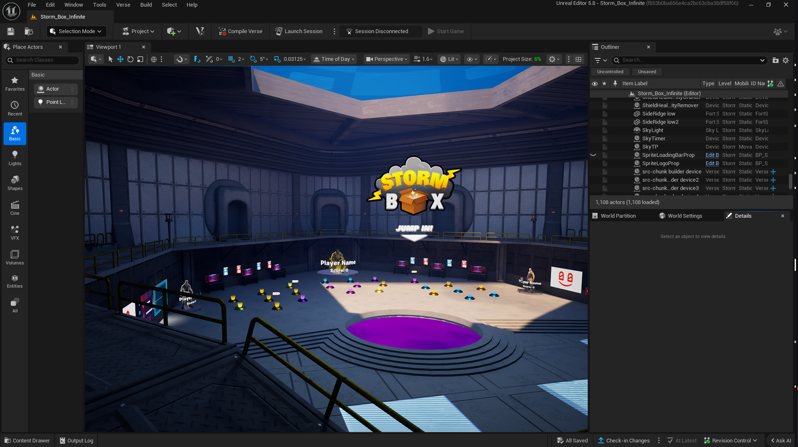
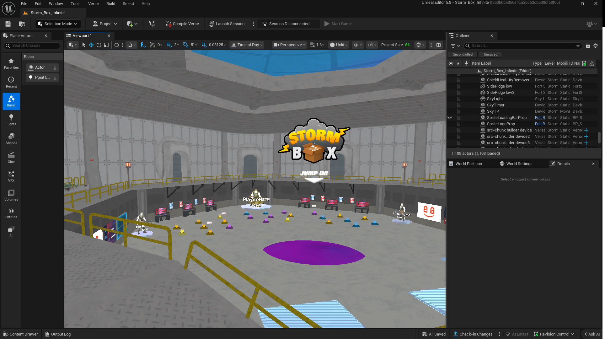

### Greybox

### Materials & Assets

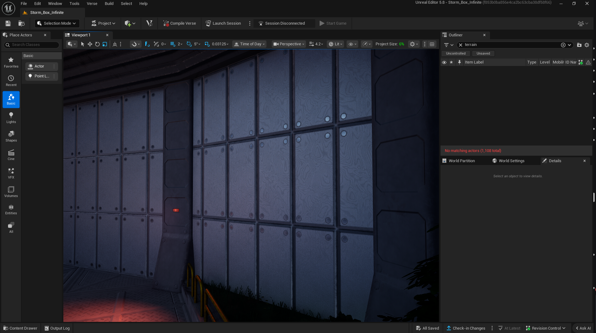

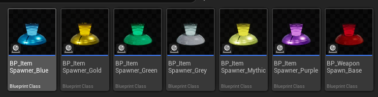

## Logo

#### V1:
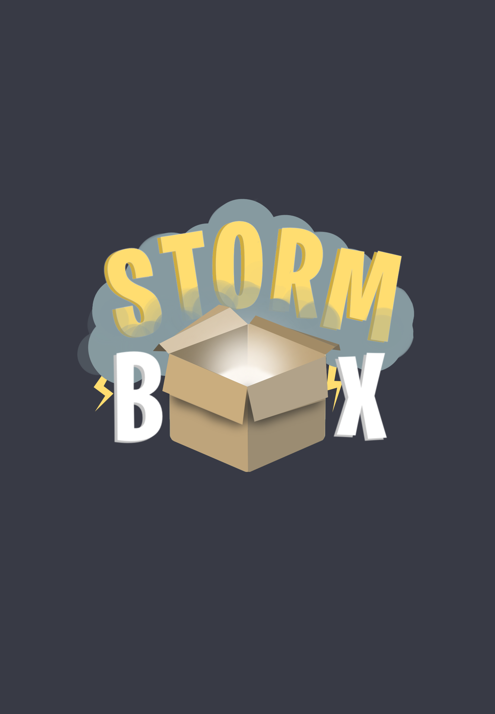

> Figure x. The first version of the logo was done in procreate. It had an old-school-Fortnite look. Using their infamous burbank font variation.
It was good to get the idea out there, but it felt a little too child-like. Not to mention, this logo was already in a pixel format meaning I could not upscale, and I did not have a license to use the font. 

#### V2:
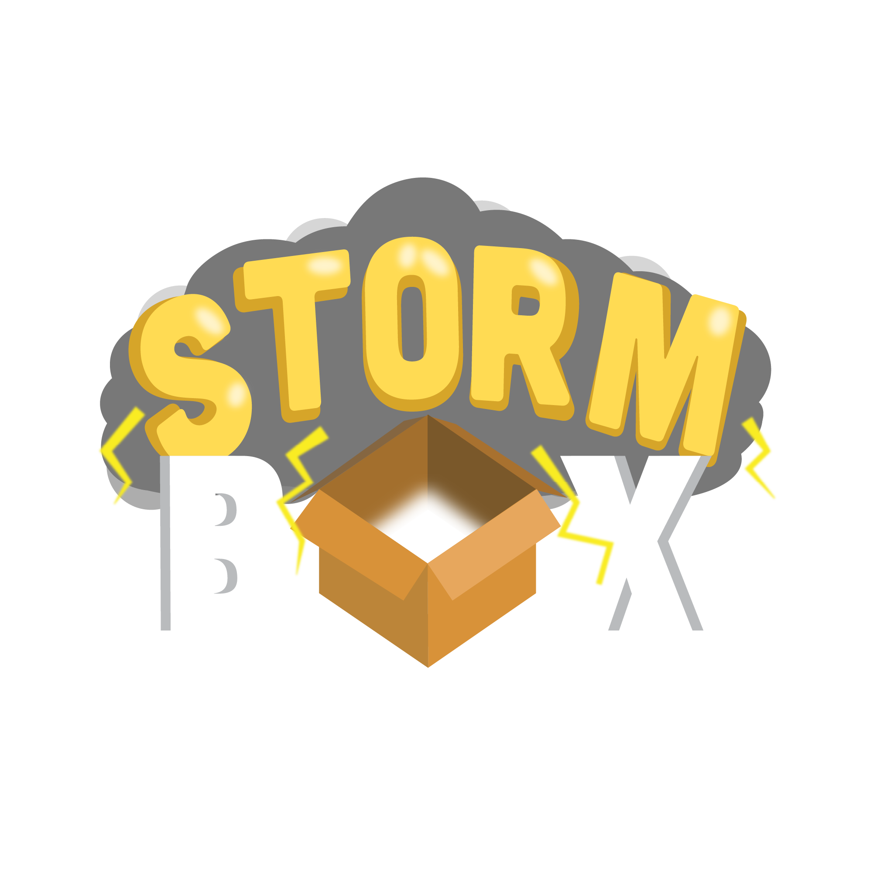

> Figure x. I was still getting familiar with Adobe Illustrator at the time. I think I was actually really impressed with this look. Looking back, this looks horrendous compared to the procreate version.

#### V3:

> Figure x. This is the final version that you see associated with this project today. I am really happy with how it turned out. The box originally did not have the glowing sparkles, but it adds the alluring effect that the previous versions had. The lightning goes diagonally across the cloud, which is a lot easier to read at small sizes, instead of the sporadic small bolts seen in the previous versions. The inclusion of gradients adds a subtle but nice touch as well. I also own a license to the font. Yippie!

## Videos

- [Social Media Gameplay Trailer](https://x.com/ZeroYaHero/status/1820093582071718187)
- [Social Media Terrain Generation Teaser](https://x.com/ZeroYaHero/status/1816518781092659348)
- [Social Media Spawn Generation System Teaser](https://x.com/ZeroYaHero/status/1819804952719442407)
- [Social Media Gameplay Clip](https://x.com/ZeroYaHero/status/1819813367873208420)
